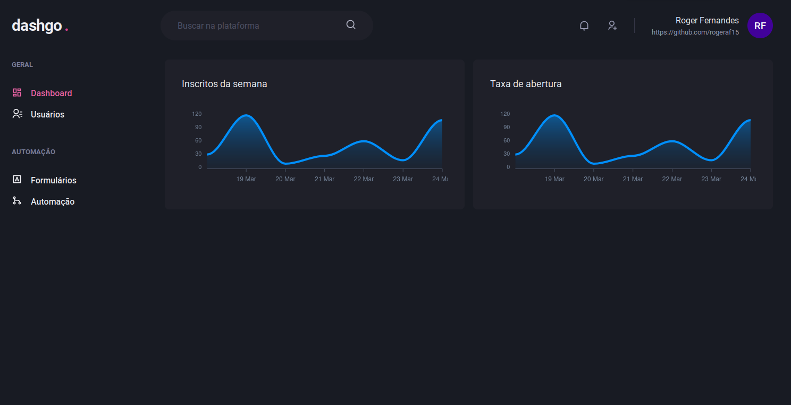

  <h1 align="center">
    dashgo
</h1>

<p align="center">
  <a href="https://www.linkedin.com/in/roger-fernandes-1488841b9/">
    
  </a>

  <a href="./LICENSE">
    
  </a>
</p>

<h4 align="center">
  This is the fourth project on the ReactJS track from the <a href="https://github.com/Rocketseat/">Rocketseat </a> Ignite bootcamp.
</h4>


<p align="center">
  <a href="#ledger-about">About</a>&nbsp;&nbsp;&nbsp;|&nbsp;&nbsp;&nbsp;
  <a href="#running-starting">Starting</a>&nbsp;&nbsp;&nbsp;|&nbsp;&nbsp;&nbsp;
  <a href="#computer-technologies">Technologies</a>&nbsp;&nbsp;&nbsp;|&nbsp;&nbsp;&nbsp;
  <a href="#memo-license">License</a>
</p>



<p align="center">
  <a href="https://rogeraf15-dashgo.netlify.app/" target="_blank">
    
  </a>
</p>

## :ledger: About
It is an application that simulates a dashboard.With the following features:

- Login
- List users
- Create new user
- Data fetching
- Cache Local
- Responsive


## :running: Starting

Before starting :checkered_flag:, you need to have installed:
- [Git](https://git-scm.com)
- [Node](https://nodejs.org/en/)
- [Yarn](https://classic.yarnpkg.com/en/)

```bash
# Clone this project
$ git clone https://github.com/rogeraf15/dashgo

# Access
$ cd dashgo

# Install dependencies
$ yarn

# Run the project
$ yarn dev

# The server will initialize in the <http://localhost:3000>
```

## :computer: Technologies

- [NextJS](https://nextjs.org/)
- [Typescript](https://www.typescriptlang.org/)
- [Axios](https://axios-http.com/)
- [Chakra UI](https://chakra-ui.com/)
- [Yup](https://github.com/jquense/yup)
- [React Hook Form](https://react-hook-form.com/)
- [React Query](https://react-query.tanstack.com)
- [Framer Motion](https://www.framer.com/motion/)
- [FakerJS](https://github.com/FotoVerite/Faker.js)
- [MirageJS](https://miragejs.com/)


## :memo: License

This project is under the MIT license. See the [LICENSE](./LICENSE) for more information.

---

Made with ♥ by Roger Fernandes :wave: [Get in touch!](https://www.linkedin.com/in/roger-fernandes-1488841b9/)

